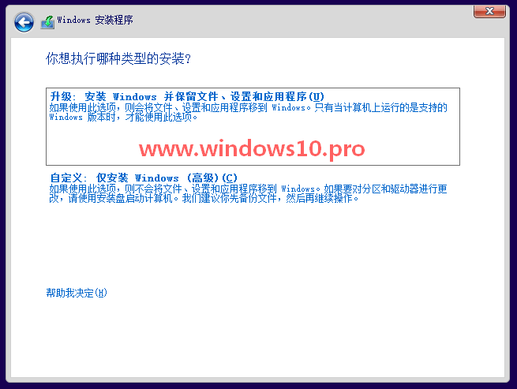
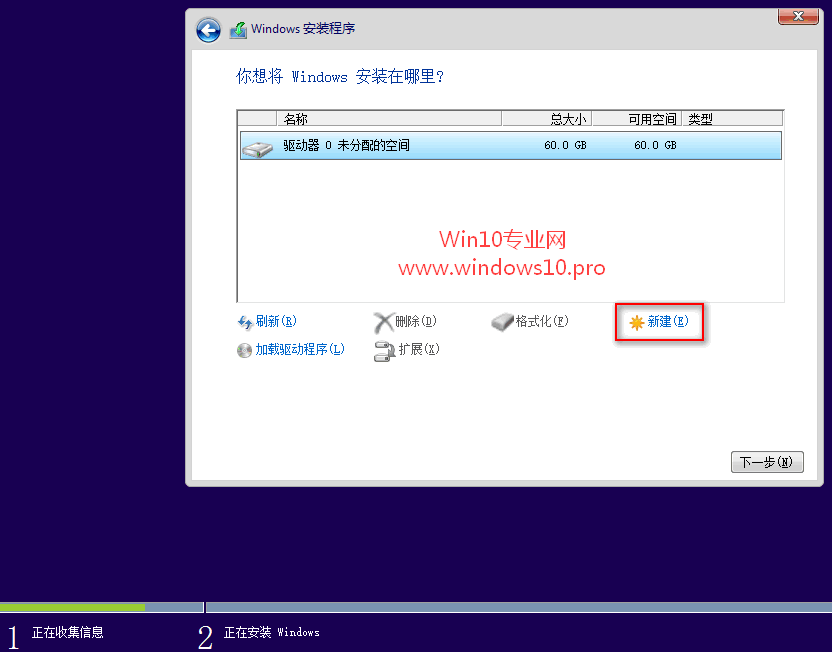
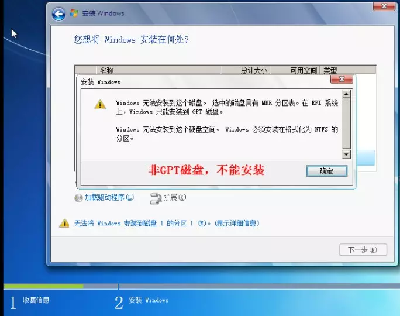

 ## 使用U盘安装win10
 1. 插入U盘.
 2. 重启电脑,从U盘启动(开机后,立即按F2,F12,Delete,Esc,打开引导菜单,选择U盘启动)
 3. 进入安装程序,无脑下一步,
 4.  这一步选择自定义
 5.   选择安装系统的磁盘
 6. 无脑下一步至完成
 
 ## win10专业版激活
 1. 管理员身份打开DOM
 2. 输入 `slmgr.vbs /upk` 回车,提示“已成功卸载了产品密钥”
 3. 输入 `slmgr /ipk W269N-WFGWX-YVC9B-4J6C9-T83GX` 回车,提示“已成功卸载了产品密钥”
 4. 输入 `slmgr /skms zh.us.to` 回车,提示“密钥管理服务计算机名成功的设置为zh.us.to”
 5. 输入 `slmgr /ato` 回车,提示“成功的激活了产品”
 
 ### 常见问题
 1. 选择安装分区时,提示无法安装,选中磁盘为MBR分区,window只能安装到GPT磁盘
 
解决方案:
 1.`Shift+F10`调出命令行
 2. diskpark(启动Diskpart程序)
 3. list disk(查看所有磁盘)
 4. select disk=0(选择第0个磁盘)
 5. clean (清除磁盘分区信息)
 6. convert gpt (设置GPT分区)